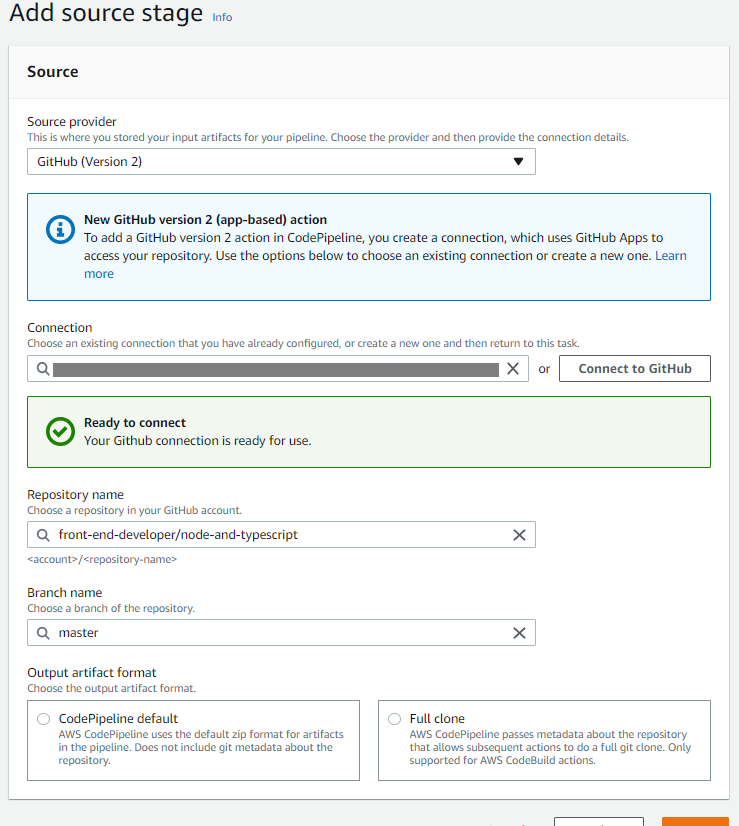
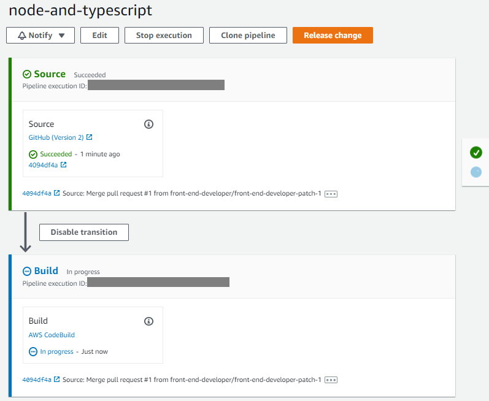

##### Mark Webley: test

Repo: https://github.com/front-end-developer/node-and-typescript

About:
Nothing fancy just something experimental with node with typescript, & automated AWS CI / CD integration.

usefulness:

npm run dev

npm run stop

npm run prod

npm run stop && npm run tsc && npm run dev

ROUTES:

http://localhost:3000

##### Github / AWS Integration

#### Github / AWS automation on CI / CD

NOTE:

when you install eslint with npx eslint --init

you have to use powershell, because the normal terminal will not allow you to select the options.
